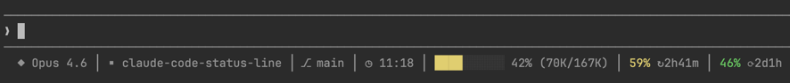

# Claude Code Status Line

[](https://code.claude.com/docs/en/hooks)

A color-coded status line for Claude Code CLI - context window usage, rate limits, project info, and git branch. Single JS file, 100 lines, no dependencies.



Everything is color-coded: context bar shifts green → yellow (60K+ tokens) → orange (80K+ tokens), rate limits turn red at >80%.

**Segments:** model, project, git branch, last message time, context bar with tokens, 5h session usage, 7d weekly usage.

## Why

Most status lines are bulky - they pull in font dependencies, demand configuration, or display information you never look at. 
This one shows exactly what an engineer needs to work efficiently with Claude Code:

- **Model & context window** - know which model you're on and how full the context is. Color shifts from green to yellow to orange so you can compact or clear before hitting the limit.
- **Time since last message** - prompt cache has a 5-min TTL that starts when the request is sent. By the time the response is generated and you read it, you realistically have 3-4 minutes. If the cache has gone cold, your next message re-reads the entire context uncached, burning 10x more of your session budget. When you see the last response time is 4+ minutes ago, better to /clear or open a new tab instead.
- **Rate limit usage (5h / 7d)** - see how much of your plan you've burned so you can pace yourself across tasks and sessions.

Knowing the cache timing also opens up a practical workflow: before stepping away for a coffee break, run `/handoff` while the cache is still hot to capture current progress, open questions, and next steps - so you can pick up exactly where you left off in a fresh, cache-friendly session. 
The handoff command is included in this repo (`commands/handoff.md`) and can be installed alongside the status line.

## Install

```bash
git clone https://github.com/philipshurpik/claude-code-status-line.git
cd claude-code-status-line
make install
```

The installer will prompt you to choose what to install:
1. **Status line only** - copies `status-line.js` to `~/.claude/` and patches `~/.claude/settings.json`
2. **Status line + handoff command** - also copies `commands/handoff.md` to `~/.claude/commands/`

### Manual install

```bash
cp status-line.js ~/.claude/
# Optional: install handoff command
mkdir -p ~/.claude/commands && cp commands/handoff.md ~/.claude/commands/
```

Add to `~/.claude/settings.json`:

```json
{
  "statusLine": {
    "type": "command",
    "command": "node ~/.claude/status-line.js",
    "padding": 0
  }
}
```

## Configuration

Edit thresholds in `~/.claude/status-line.js`:

```javascript
const AUTOCOMPACT_BUFFER_TOKENS = 33_000;  // subtracted from raw window
const WARN_TOKENS = 60_000;                // yellow
const COMPACT_TOKENS = 80_000;             // orange
```

## Uninstall

```bash
rm ~/.claude/status-line.js
```

Then remove the `statusLine` entry from `~/.claude/settings.json`.
